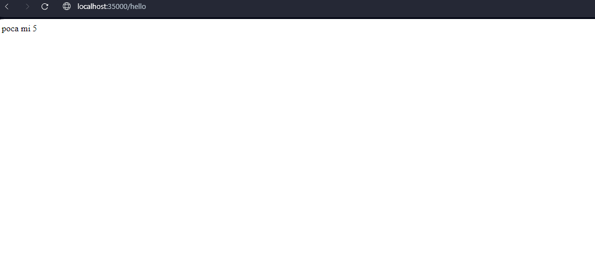
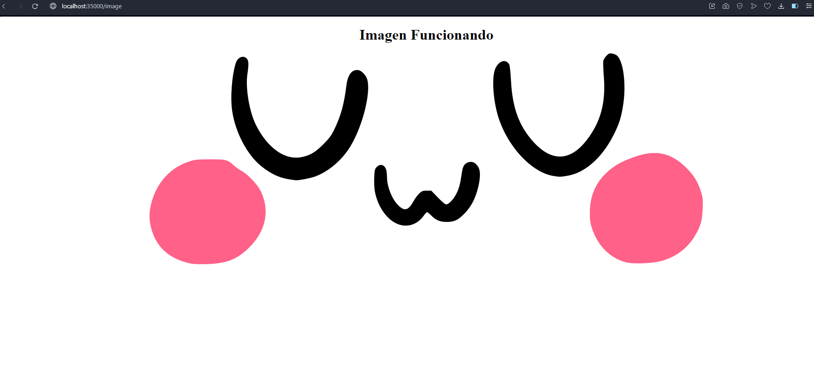
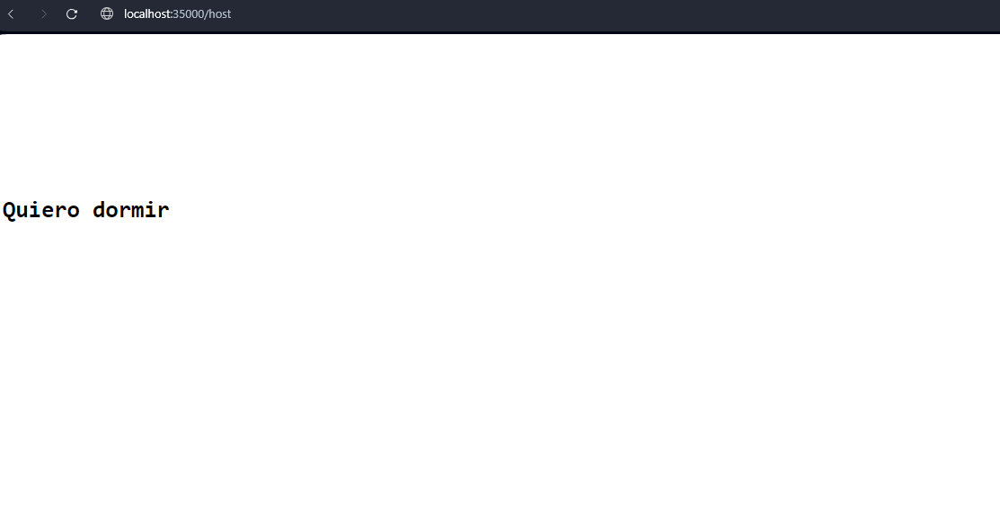

# TALLER 4: TALLER DE ARQUITECTURAS DE SERVIDORES DE APLICACIONES, META PROTOCOLOS DE OBJETOS, PATRÓN IOC, REFLEXIÓN

Servidor Web (tipo Apache) en Java. El servidor es capaz de entregar páginas html e imágenes tipo PNG. Igualmente el servidor provee un framework IoC para la construcción de aplicaciones web a partir de POJOS. El servidor atendiende múltiples solicitudes no concurrentes.


### Requisitos 

* [Git](https://git-scm.com/) - Control de versiones
* [Maven](https://maven.apache.org/) - Manejador de dependencias
* [Java](https://www.oracle.com/java/technologies/downloads/#java21) - Lenguaje de programación


### Instalación 

Clonamos el proyecto con el comando:

```bash
git clone https://github.com/cattus09/taller_4_AREP.git

```

## Ejecutando la aplicación

Para ejecutar la aplicación, usamos el siguiente comando en la terminal:

```bash
java -cp target/classes edu.escuelaing.arep.app.spring.server.ServerExecuter 

```

## Ejecutando las pruebas 

Usamos el siguiente comando para ejecutar las pruebas:

```bash
mvn test
```

## Generando Javadoc 

Para generar la documentación de la aplicación, use el siguiente comando: 

```bash
mvn site
```

los archivos Javadoc se generarán en el directorio `target/site/apidocs` dentro del proyecto.

entre a la la carpeta `target/site/` y ejecute el `index.html` en la pagina encontrar la documentacion del trabajo 


## Pruebas 

En el buscador de su preferencia ingresamos a: 

[http://localhost:35000/hello](http://localhost:35000/hello).



[http://localhost:35000/image](http://localhost:35000/image).



[http://localhost:35000/hello](http://localhost:35000/host).




## Autores 

* **Sergio gonzalez** - [cattus09](https://github.com/cattus09)


"# taller_2_AREP" 
